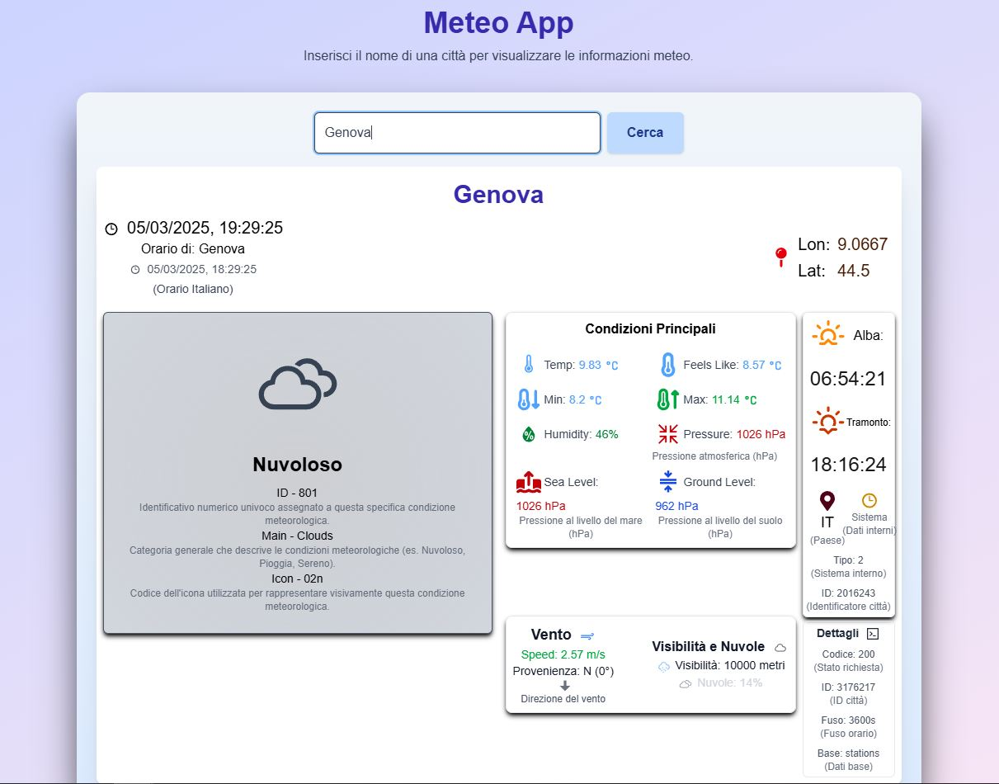

[](https://opensource.org/licenses/MIT)
[](https://nextjs.org/)
[](https://www.typescriptlang.org/)
[](https://tailwindcss.com/)
[](https://www.docker.com/)

# ️ Meteo App - Scopri il Meteo Ovunque Tu Sia

**Un'applicazione web moderna per visualizzare le informazioni meteo, costruita con Next.js, TypeScript, Tailwind CSS e un backend PHP con Docker.**

 ## ✨ Panoramica

"Meteo App" è un'applicazione web che ti permette di visualizzare le informazioni meteo di qualsiasi città nel mondo. Il frontend è sviluppato con Next.js, TypeScript e Tailwind CSS per un'interfaccia utente reattiva e moderna. Il backend è un'API PHP che comunica con OpenWeatherMap per recuperare i dati meteo. L'applicazione è containerizzata con Docker per una facile distribuzione e riproducibilità.

##  Funzionalità Principali

* **Ricerca Meteo:** Inserisci il nome di una città e visualizza le informazioni meteo in tempo reale.
* **Dati Meteo Dettagliati:** Visualizza temperatura, umidità, descrizione del tempo e velocità del vento.
* **Interfaccia Utente Reattiva:** L'applicazione si adatta a diverse dimensioni dello schermo per un'esperienza utente ottimale.
* **Persistenza Dati:** Il backend PHP comunica con l'API OpenWeatherMap, garantendo dati sempre aggiornati.
* **Containerizzazione Docker:** L'applicazione è containerizzata con Docker per una facile distribuzione e riproducibilità.

## ️ Tecnologie Utilizzate

* **Frontend:**
    * **[Next.js](https://nextjs.org/)**: Framework React per la costruzione di applicazioni web performanti.
    * **[TypeScript](https://www.typescriptlang.org/)**: Superset di JavaScript per un codice più robusto e manutenibile.
    * **[Tailwind CSS](https://tailwindcss.com/)**: Framework CSS utility-first per uno styling rapido e personalizzabile.
* **Backend:**
    * **[PHP](https://www.php.net/)**: Linguaggio di scripting lato server per l'API.
    * **[OpenWeatherMap API](https://openweathermap.org/api)**: API per recuperare i dati meteo.
* **Containerizzazione:**
    * **[Docker](https://www.docker.com/)**: Piattaforma per la containerizzazione delle applicazioni.

## ⚙️ Installazione e Utilizzo (Sviluppo Locale)

1.  **Clona il repository:**

    ```bash
    git clone [https://arxiv.org/abs/2402.14323](https://arxiv.org/abs/2402.14323)
    cd [nome della cartella del repository]
    ```

2.  **Avvia i container Docker:**

    ```bash
    docker-compose up -d --build
    ```

3.  **Accedi all'applicazione:**

    * Il frontend sarà disponibile all'indirizzo `http://localhost:3000`.
    * Il backend sarà disponibile all'indirizzo `http://localhost:8090`.

##  Configurazione API Key

* Crea un file `.env` nella directory principale del progetto.
* Aggiungi la tua API key di OpenWeatherMap nel seguente formato:

    ```
    OPENWEATHERMAP_API_KEY=YOUR_API_KEY
    ```

* **Importante:** Aggiungi `.env` al tuo file `.gitignore` per evitare di committare la tua API key.

##  Licenza

Questo progetto è distribuito sotto la [Licenza MIT](LICENSE).

## ‍ Autore

[davide017017 - Davide Martinco] - [[Link al tuo profilo GitHub o Portfolio (opzionale)](https://github.com/davide017017)]

**Realizzato con ❤️ e codice da davide017017**